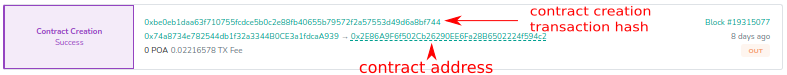
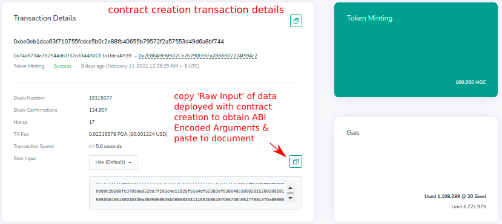
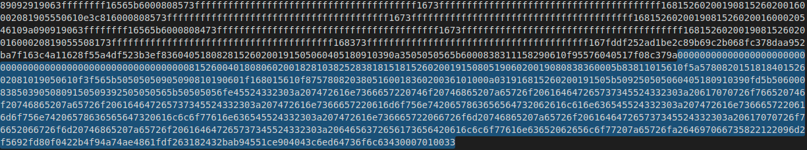
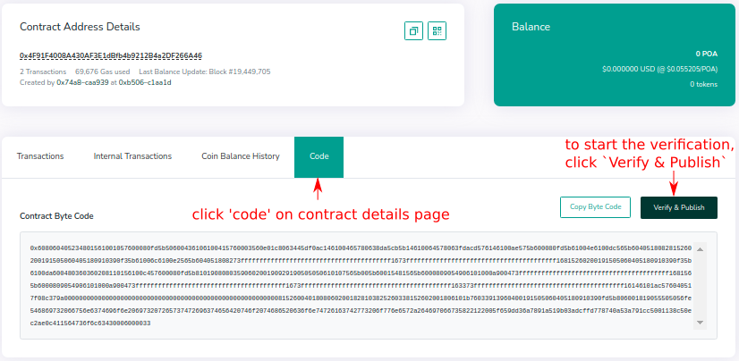
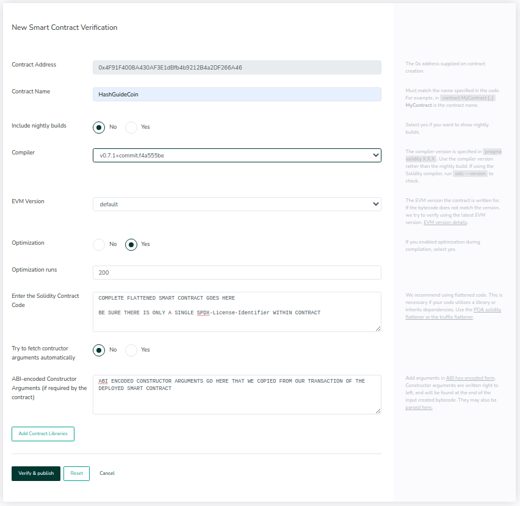
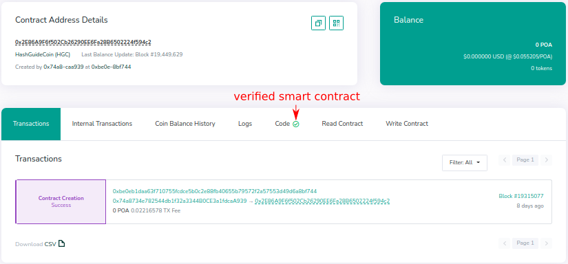
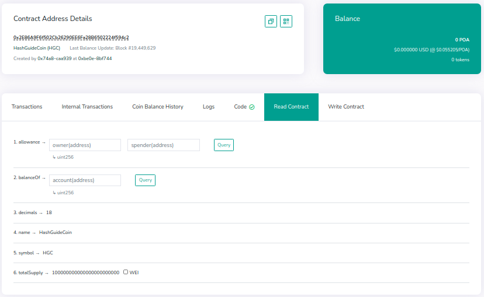
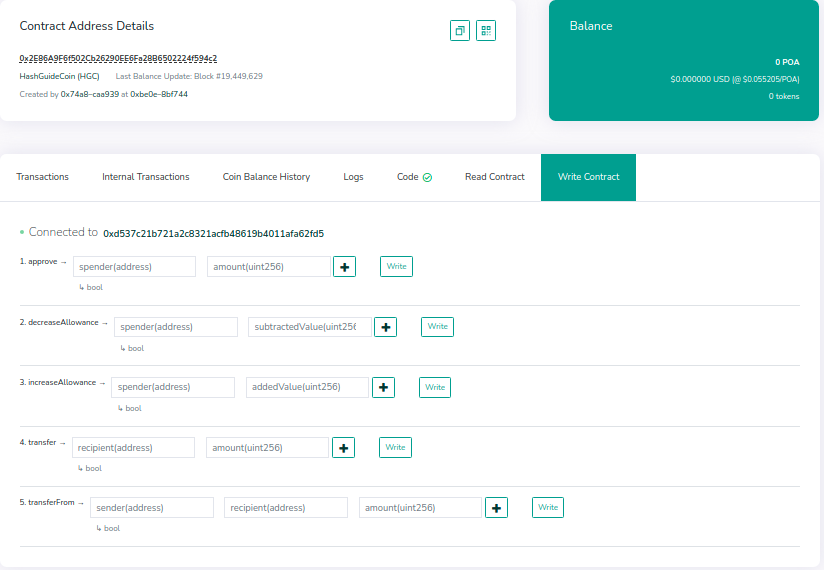

# Verifying Smart Contract using Blockscout
In this guide, I will be showing you how to verify smart contracts on POA's Blockscout Block Explorer. Blockscout is an Open Source Ethereum Block Explorer which will work with any EVM-based blockchain network. Blockscout is a masterpiece provided to the Ethereum Developer Community & has been introduced as a deployable application on Amazon's AWS Computing Sector.

## Before we begin
To follow along with this guide, make sure you already have a Smart Contract deployed to a Blockchain Network that is supported by the offical Blockscout.com block explorer or separate instance that could be deployed by other teams in the crypto space. Blockchains supported by Blockscout.com are; xDai, POA Core & POA Sokol Test, Ethereum Classic, & RSK.

### Need a contract to verify?
If you do not have a smart contract deployed to one of these networks, you could begin with my other guide showing you how to Deploy your own ERC20 Token to POA's Sokol Test Network. The ERC20 Deployment guide uses the solidity development tool Truffle to deploy & manage contracts & we used OpenZeppelin library of smart contracts to write our token contract using ERC Standard contracts we already know have been tested.

### ABI Encoded Compiled Bytecode of Constructor Args
After have deploying a smart contract to a network, we make use of the Transaction Hash of the deployed smart contract. This is where we can easily obtain the ABI-Encoded Constructor Arguments needed to verify a smart contract. It has been a known issue with some applications that compile & deploy smart contracts giving errors that Compiled Bytecode does NOT match Contract Creation arguments. To prevent this, simply follow directions in this guide & in the YouTube video to find your ABI Encoded compiled Bytecode that matches with deployed contracts.

### Make note of
When you are writing your smart contracts with whichever tool you choose, always make note of the SOLC version or whichever compiler you are using. You will also want to note whether or not you are using smart contract optimization. If you are using contract optimization, note how many optimization runs the compiler has made. With the many Hard Forks Ethereum has gone through preparing for the proof-of-work conversion to a staking consensus, we also need to keep track of the EVM version used during deployment. If you are unsure of this setting, just leave it at the default because chances are you used that version to deploy to.

## The procedure
### Flattening our contract
If OpenZeppelin has been used or separate contract files for your deployment, you will need to flatten your smart contracts. This combines all code to a single document & removes all import statements made within the code, thus preparing it for validation. To do this, we will use an tool called `truffle-flattener`. You can install it globally using `npm` or `yarn` with the following commands within system terminal.

`npm i -g truffle-flattener`
OR
`yarn global add truffle-flattener`

To run this tool against your current project, you would run the following commands within your system terminal inside your projects root directory. Replace `HashGuideCoin` with the name of your contract in the contracts folder you would like to verify.

`truffle-flattener ./contracts/HashGuideCoin.sol > ./contracts/HashGuideCoin_flattened.sol`

**This will create a new solidity file in the `contracts` folder with the complete contract in a single document.**
_**You will need to remove the additional `SPDX-License-Identifier` statements within the flattened file in order for verification to be successful**_

### Navigating Blockscout
- Go to Blockscout.com & locate the smart contract that you would like to verify or go to the address used to deploy contract. Look for the smart contract you would like to verify & it will be easier to open two pages in separate tabs to obtain data as needed. First open up the 'Contract Address' in one tab & 'Transaction Hash' of the same contract that was deployed.
  

- Open the Transaction Data within Blockscout & look for the section 'Raw Input'. Here is where we will obtain the ABI Encoded Bytecode of the Constructor Arguments needed to verify a smart contract on ethereum based networks. Copy the 'Raw Input' provided in the transaction of your deployed smart contract & paste it into a new file for editing.
  

- Within this new file, scroll to the bottom of the data. You want to look for the last string of the data that begins with a bunch of 0's. Select from the first '0' you see until the last character & copy that string & remove the rest you don't need, then paste your encoded arguments in the temporary file. **See below for an example.** 
  

- Now, on our deployed Smart Contract details page in Blockscout, we want to open up the `Code` section of the page. Once there, you will see a Button labeled `Verify & Publish` & this is where we begin the process on Blockscout to verify our contract. Be sure to have all the correct compiler information before moving forward & correct optimization info for your deployed contracts. 
  

  
**Preview of the Verify & Publish form on Blockscout.com**\
 

_**If there was no additional libraries used within your contracts, you do not need to worry about the 'Libraries' section of this form. We will be going over Solidity Libraries in another guide, but for now, just the basics.**_

### After verification
After verifying your smart contracts on Blockscout block explorer, you may interact with your contracts within the Blockscout UI just like you would anywhere else. You are able to Read from them as well as Writing to them using your local web3 enabled wallet such as Metamask or Nifty wallet. Below are some examples of the features Blockscout provides for interacting with smart contracts.

**You get the cool Verified Checkmark next to your 'Code'.**\

**Read all functions enabled within your smart contract all while verifying latest transactions.**\

**Write to your contracts using your local web3 enabled wallet such as Metamask or Nifty wallet**\

